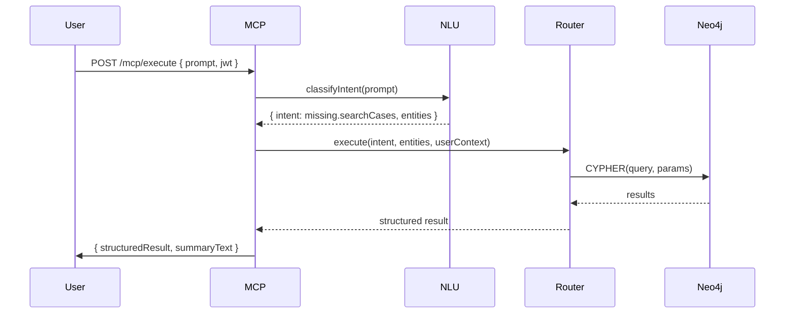

# AMC Unified MCP Server Blueprint
**Format:** Combined Developer Blueprint (Markdown + JSON blocks)  
**Includes:** Mermaid diagrams, tool manifests, Cypher templates, security model, NLU mapping, Cursor implementation hints.

---

## Table of Contents
1. Overview
2. Architecture (Mermaid diagrams)
3. Data Flow Patterns
4. Core Server Modules & Design Patterns
5. Tool / Function Definition Spec
6. Missing Persons: Tool Manifest & Cypher Templates
7. NLU / Natural-Language → Tool Mapping Guide
8. Authentication & Security (JWT, scopes, token exchange)
9. Query Routing & Intent Detection
10. Error Handling & Validation
11. Integration & Discovery (App registration)
12. Operational Notes (deployment, monitoring)
13. Cursor Handoff Checklist & Implementation Hints
14. Appendices: Example OpenAPI, Example Audit Log, Quick Cypher snippets

---

## 1. Overview
This document is a **language-agnostic** blueprint for an MCP (Model Context Protocol) server that will act as a secure bridge between AI assistants and multiple Node.js applications used by the Assembly of Manitoba Chiefs (AMC).  
Primary goal: enable staff to ask plain-English questions that map to safe operations against your apps (Missing Persons, Finance reporting (read-only), Office Tracker, and future apps).

Key constraints:
- Backend graph DB: **Neo4j** (Missing Persons)
- Apps expose Express.js REST APIs
- Authentication: **JWT**
- First integration: Missing Persons (go-live soon)

---

## 2. Architecture (Mermaid diagrams)

### 2.1 High-level architecture
```mermaid
flowchart TD
  subgraph Client
    U[User UI / Chat Box]
    AI[AI Assistant (ChatGPT / Cursor / Gemini)]
  end

  U -->|typed query + JWT| MCP[MCP Server]
  AI -->|optional server-to-server| MCP

  MCP --> NR[NLU / Intent Engine]
  MCP --> TR[Tool Router / Orchestrator]
  TR -->|neo4j connector| NG[Neo4j DB]
  TR -->|sql connector| SQL[SQL / Sage Replica]
  TR -->|rest connector| REST[Node.js Apps (Express)]
  TR -->|storage connector| S3[Spaces / S3]
  MCP --> AUD[Audit Store]

  classDef infra fill:#f9f,stroke:#333,stroke-width:1px;
  class NG,SQL,REST,S3 infra;
```

### 2.2 Sequence: User query → MCP → Missing Persons


---

## 3. Data Flow Patterns
- **Synchronous read**: User query → MCP -> backend -> response (fast searches, summaries).
- **Synchronous write**: Requires stronger auth; may require `confirm` or 2FA for sensitive operations.
- **Composite / orchestrated**: MCP composes multiple tool calls (e.g., fetch case, fetch events, call LLM to summarize).
- **Background job**: Long running tasks return `202 Accepted` and a `status` endpoint for polling.
- **Audit stream**: Every tool call emits an audit event written to immutable audit storage (Neo4j `AuditLog` or append-only file).

---

## 4. Core Server Modules & Design Patterns

### 4.1 Modules
- **api/** - HTTP endpoints: `/mcp/execute`, `/tools`, `/tools/:id`, `/health`, `/register`
- **auth/** - JWT validation, scope mapping, token exchange
- **nlu/** - intent classifier, entity extractor, embedding store
- **tools/** - registry of tool manifests (JSON), handler glue
- **connectors/** - neo4j, sql, rest, storage adapters
- **router/** - orchestrator, validation, permission checks
- **audit/** - append-only logging & audit APIs
- **policies/** - RBAC and attribute policies
- **jobs/** - background workers and task queue
- **llm/** - optional LLM wrapper for summarization, embeddings
- **utils/** - schema validation, sanitization, tracing

### 4.2 Patterns
- **Tool as contract**: each tool exposes `toolId`, `inputSchema`, `outputSchema`, `scopes`, `handler`.
- **Adapter pattern**: connectors implement `execute(handlerSpec, params, ctx)`.
- **Orchestration pattern**: composite tools define ordered steps.
- **Policy evaluation**: centralized PDP (policy decision point) that enforces node-level and attribute-level checks.
- **Idempotence and safe writes**: writes use idempotency keys when possible.

---

## 5. Tool / Function Definition Spec

A tool manifest (language-agnostic JSON) example:
```json
{
  "toolId": "missing.searchCases",
  "title": "Search Missing Person Cases",
  "description": "Search active/closed/suspended missing person cases by filters",
  "permissionScopes": ["missing.read"],
  "capabilities": ["search", "filter", "aggregate"],
  "inputSchema": {
    "type": "object",
    "properties": {
      "status": {"type":"string"},
      "community": {"type":"string"},
      "dateFrom": {"type":"string","format":"date"},
      "dateTo": {"type":"string","format":"date"},
      "keyword": {"type":"string"},
      "limit": {"type":"integer","default":50, "maximum":200},
      "offset": {"type":"integer","default":0}
    }
  },
  "outputSchema": {
    "type": "object",
    "properties": {
      "cases": {"type":"array"}
    }
  },
  "handler": {
    "type": "neo4j",
    "operation": "cypher",
    "template": "MATCH ... RETURN ..."
  },
  "sensitivity": "restricted",
  "timeoutMs": 8000
}
```

**Validation**
- All tool inputs must be validated against `inputSchema` at the MCP edge.
- Use JSON Schema validators (AJV for JS, or equivalent).

**Response Format**
```json
{
  "status": "ok",
  "toolId": "missing.searchCases",
  "meta": {"queryId":"...","execMs":120},
  "data": { "cases":[ ... ] }
}
```

Errors follow a canonical structure (see section 10).

---

## 6. Missing Persons: Tool Manifest & Cypher Templates

Below are concrete, Cursor-ready tool manifests and Cypher templates using your provided schema. Cursor can take these and implement handlers.

> NOTE: Neo4j labels from your schema: `User, Applicant, LovedOne, Note, Community, File, Organization, AuditLog, NewsItem, CaseEvent, Config`  
> Relationship types: `ASSIGNED_TO, HAS_NOTE, RELATED_TO, HAS_FILE, SUPPORTS, LOCATED_IN, HAS_EVENT, NOTIFIED_TO`

### 6.1 Tool: missing.getCase
```json
{
  "toolId": "missing.getCase",
  "title": "Get Missing Case by ID",
  "permissionScopes": ["missing.read"],
  "inputSchema": {"type":"object","required":["caseId"],"properties":{"caseId":{"type":"string"}}},
  "outputSchema": {"type":"object"},
  "handler": {
    "type":"neo4j",
    "operation":"cypher",
    "template": "MATCH (c:MissingCase {id:$caseId}) "
                + "OPTIONAL MATCH (c)-[:RELATED_TO]->(p:Applicant) "
                + "OPTIONAL MATCH (c)-[:HAS_NOTE]->(n:Note) "
                + "OPTIONAL MATCH (c)-[:HAS_FILE]->(f:File) "
                + "OPTIONAL MATCH (c)-[:HAS_EVENT]->(e:CaseEvent) "
                + "OPTIONAL MATCH (c)-[:LOCATED_IN]->(comm:Community) "
                + "RETURN c, collect(DISTINCT p) AS applicants, collect(DISTINCT n) AS notes, collect(DISTINCT f) AS files, collect(DISTINCT e) AS events, comm;"
  }
}
```

### 6.2 Tool: missing.searchCases
```json
{
 "toolId":"missing.searchCases",
 "permissionScopes":["missing.read"],
 "inputSchema": { "type":"object", "properties":{
    "status":{"type":"string"},
    "community":{"type":"string"},
    "dateFrom":{"type":"string","format":"date"},
    "dateTo":{"type":"string","format":"date"},
    "keyword":{"type":"string"},
    "limit":{"type":"integer","default":50,"maximum":200},
    "offset":{"type":"integer","default":0}
 }},
 "handler": {
   "type":"neo4j", "operation":"cypher",
   "template": "WITH $params AS p "
             + "MATCH (c:MissingCase) "
             + "OPTIONAL MATCH (c)-[:LOCATED_IN]->(comm:Community) "
             + "WHERE (p.status IS NULL OR c.status = p.status) "
             + "AND (p.community IS NULL OR toLower(comm.name) CONTAINS toLower(p.community)) "
             + "AND (p.keyword IS NULL OR toLower(c.title) CONTAINS toLower(p.keyword) OR toLower(c.description) CONTAINS toLower(p.keyword)) "
             + "AND (p.dateFrom IS NULL OR c.dateOfIncident >= date(p.dateFrom)) "
             + "AND (p.dateTo IS NULL OR c.dateOfIncident <= date(p.dateTo)) "
             + "RETURN c, comm ORDER BY c.dateOfIncident DESC SKIP p.offset LIMIT p.limit;"
 }
}
```

### 6.3 Tool: missing.addNote (write)
```json
{
 "toolId":"missing.addNote",
 "permissionScopes":["missing.write"],
 "inputSchema": {"type":"object","required":["caseId","author","text"], "properties":{
     "caseId":{"type":"string"},
     "author":{"type":"string"},
     "text":{"type":"string","maxLength":5000},
     "private":{"type":"boolean","default":true}
 }},
 "handler": {
   "type":"neo4j","operation":"cypher",
   "template": "MATCH (c:MissingCase {id:$caseId}) "
             + "CREATE (n:Note {id:apoc.create.uuid(), author:$author, text:$text, timestamp:datetime(), private:$private}) "
             + "CREATE (c)-[:HAS_NOTE]->(n) RETURN n;"
 }
}
```

### 6.4 Tool: missing.searchNearbySightings
```json
{
 "toolId":"missing.searchNearbySightings",
 "permissionScopes":["missing.read"],
 "inputSchema": {"type":"object","required":["latitude","longitude","radiusKm"], "properties":{
    "latitude":{"type":"number"}, "longitude":{"type":"number"}, "radiusKm":{"type":"number","minimum":0.1}
 }},
 "handler":{
   "type":"neo4j","operation":"cypher",
   "template":"WITH point({latitude:$latitude, longitude:$longitude}) AS center, $radiusKm AS rKm "
            + "MATCH (s:CaseEvent) WHERE s.latitude IS NOT NULL AND s.longitude IS NOT NULL "
            + "WITH s, distance(point({latitude:s.latitude, longitude:s.longitude}), center)/1000 AS km WHERE km <= rKm "
            + "RETURN s, km ORDER BY km ASC LIMIT 200;"
 }
}
```

> Cursor note: replace `apoc.create.uuid()` with your chosen UUID strategy if APOC is not available. Use parameterized queries (no string concatenation).

---

## 7. NLU / Natural-Language → Tool Mapping Guide

### 7.1 Approach (hybrid)
- **Rule-based** quick match for explicit commands (case #, "summarize case 12345", direct ID)
- **Embedding-based semantic similarity**: vectorize tool manifest descriptions and user prompt; pick tool by highest similarity score + threshold
- **Entity extractor**: regex and model-based extraction for dates, locations, coordinates, numeric values, IDs
- **Dialog manager**: handle clarification questions and multi-turn context

### 7.2 Example mapping pseudocode
```
function mapPromptToTool(prompt, userContext) {
  if (matchRegexCaseId(prompt)) return {tool:"missing.getCase", params:{caseId:...}}
  let candidates = semanticSearchToolManifests(prompt)
  if (topCandidate.confidence > 0.85) return mapEntitiesToParams(candidates[0], prompt)
  else askClarifyingQuestion()
}
```

### 7.3 Example prompts -> mapped tools
- "Show active cases in Peguis last 7 days" -> `missing.searchCases {status:active, community:Peguis, dateFrom:...}`
- "Summarize case 12345" -> `missing.summarizeCase {caseId:12345}`
- "Add note to case 12345: family reported sighting" -> `missing.addNote {caseId, author=currentUser, text=...}`

---

## 8. Authentication & Security

### 8.1 JWT handling
- MCP validates incoming JWT: check signature, `exp`, `iss`, `aud`.
- Extract `sub`, `roles`, `scopes`, `communities` claims.
- Map scopes to tool permissions (e.g., `missing.read`, `missing.write`).
- Reject requests without required scopes.

### 8.2 Service-to-service auth
- MCP uses service credentials (client-id/secret or mTLS) to connect to downstream APIs.
- Keep DB credentials & LLM keys in secrets manager.

### 8.3 Token exchange & impersonation
- If downstream APIs require their own JWT, MCP performs a token exchange using a pre-authorized service account.
- Log and audit any impersonation.

### 8.4 Node-level / record-level checks
- Example: user with `missing.read` can only see cases for their `communities` unless they have `admin` role.
- Enforce in Router before returning data; when necessary, apply Cypher filters to limit returned nodes.

### 8.5 Data minimization & PII
- LLM outputs must redact or generalize PII unless the `view_pii` scope is present.
- Example: replace exact coordinates with “within X km of [community]” for non-privileged users.

---

## 9. Query Routing & Intent Detection (detailed)

### 9.1 Steps
1. **Preprocess** (normalize prompt)
2. **Fast pattern matching** (IDs, direct commands)
3. **Semantic match** (embeddings vs tool descriptions)
4. **Entity extraction & param normalization**
5. **Policy check** (user scopes, community match)
6. **Execute tool** or **ask clarifying q** if missing params

### 9.2 Confidence thresholds & fallbacks
- If top semantic match < 0.6 → ask clarifying question
- If 0.6–0.85 → show predicted mapping and ask user to confirm
- If > 0.85 → auto-execute (for safe, read-only ops)
- For write ops always require explicit confirmation (unless UI has 'trusted mode')

---

## 10. Error Handling & Validation

### 10.1 Standard error schema
```json
{
 "status":"error",
 "error": {
   "code":"MCP_INVALID_INPUT",
   "message":"Missing parameter community",
   "toolId":"missing.searchCases",
   "details": { "param":"community" },
   "traceId":"..."
 }
}
```

### 10.2 Retry & circuit breaker
- Retries for transient DB errors up to 3 attempts with exponential backoff.
- Circuit breaker to prevent hammering failing backends; fallback messages returned to user.

### 10.3 Validation
- Input schema validation at edge.
- Enforce max limits, pagination, and result caps.
- Sanitize text fields (limit length, strip suspicious payloads).

---

## 11. Integration & Discovery

### 11.1 App registration
- Static manifest in Git for small deployments.
- Optional dynamic `/register` endpoint where apps register and provide their tool manifests.

### 11.2 Discovery endpoints
- `/tools` - list all tools with short descriptions
- `/tools/:toolId` - full manifest including `inputSchema`

### 11.3 Versioning
- Tools include `version` property. MCP supports `toolId@v1.2`.
- Deprecation: provide `deprecatedUntil` and `migrateTo` hints in manifest.

---

## 12. Operational Notes

### 12.1 Deployment
- Production: Linux (Ubuntu 22.04) containers or single-node Docker Compose.
- Secrets in Vault or cloud secrets manager.
- Use systemd for single-server resilience.
- Backups for Neo4j and SQL.

### 12.2 Monitoring
- Prometheus metrics for tool latency & error rates.
- OpenTelemetry tracing for request flows.
- Alerts for high error rates or rising latencies.

### 12.3 Testing
- Unit test tool handlers with a mock Neo4j.
- Integration tests running a test Neo4j dataset.
- NLU test harness: sample prompts → expected tool mapping.

---

## 13. Cursor Handoff Checklist & Implementation Hints

### 13.1 Files to hand Cursor (provide these as repo files)
- `tools/manifest/*.json` (tool manifests per tool)
- `connectors/neo4j/adapter.js` (execute cypher with parameters)
- `router/orchestrator.js` (validation, policy check, execute)
- `auth/jwt.js` (validate JWT, map scopes)
- `nlu/semantic.js` (embedding-based tool selector)
- `api/execute.js` (POST /mcp/execute)
- `docs/README.md` (explain development flow & secrets)

### 13.2 Implementation hints
- **Parameterization**: Use parameterized Cypher queries (`session.run(cypher, params)`) to prevent injection.
- **UUID**: Use UUIDv4. If APOC not available, generate in app layer.
- **Pagination**: Use `SKIP`/`LIMIT` with safe upper limits.
- **LLM prompts**: Keep LLM prompts small: "Summarize these 5 case objects in plain English, mask exact coordinates unless user has view_pii."
- **Embeddings**: Vectorize `toolId + description` to build an embedding index for semantic matching.
- **Testing**: Provide a small test fixture DB (10-20 nodes) for Cursor to run integration tests.

### 13.3 Security checklist for Cursor
- Never commit secrets.
- Use environment variables for DB creds.
- Ensure JWT public keys are fetched from well-known `/.well-known` endpoints or stored in secret manager.
- Implement rate-limiting for tool calls.

---

## 14. Appendices

### 14.1 Example OpenAPI (minimal)
```yaml
openapi: 3.0.1
info:
  title: AMC MCP
paths:
  /mcp/execute:
    post:
      summary: Execute MCP tool
      requestBody:
        content:
          application/json:
            schema:
              type: object
              properties:
                toolId: { type: string }
                params: { type: object }
                jwt: { type: string }
      responses:
        '200':
          description: success
```

### 14.2 Quick Cypher snippets
- List communities:
```cypher
MATCH (c:Community) RETURN c.name AS name, c.id AS id ORDER BY name;
```
- Assign case:
```cypher
MATCH (case:MissingCase {id:$caseId}), (u:User {id:$userId})
CREATE (case)-[:ASSIGNED_TO]->(u)
RETURN case, u;
```

---

# Final notes & next steps
1. Cursor should be given:
   - This file (manifest + Cypher templates)
   - Secrets access (in a secure way)
   - A small test Neo4j instance and sample data
2. I will help iterate on tool manifests after Cursor produces initial code.
3. Once implemented, run NLU tests with typical staff prompts and refine mapping thresholds.

---

**Download full single-file blueprint:**  
[Download AMC_MCP_Blueprint.md](sandbox:/mnt/data/AMC_MCP_Blueprint.md)

---

## Done — extras for Cursor (short list)
- Use Node.js + TypeScript for MCP (recommended)
- Use `neo4j-driver` for DB access
- Use AJV for input schema validation
- Use `express` for API, but keep code modular for other runtimes
- Use `openai` or provider SDK for embeddings / summarization if required
- Include `tools/manifest` JSON files as canonical source-of-truth

