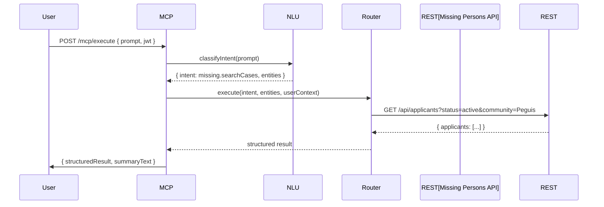

# AMC Unified MCP Server Blueprint (CORRECTED)
**Format:** Combined Developer Blueprint (Markdown + JSON blocks)  
**Includes:** Mermaid diagrams, tool manifests, Cypher templates, security model, NLU mapping, Cursor implementation hints.  
**Status:** Corrected for actual Missing Persons app schema and REST API patterns.

---

## Table of Contents
1. Overview
2. Architecture (Mermaid diagrams)
3. Data Flow Patterns
4. Core Server Modules & Design Patterns
5. Tool / Function Definition Spec
6. Missing Persons: Tool Manifest & Implementation (CORRECTED)
7. NLU / Natural-Language → Tool Mapping Guide
8. Authentication & Security (JWT, scopes, token exchange)
9. Query Routing & Intent Detection
10. Error Handling & Validation
11. Integration & Discovery (App registration)
12. Operational Notes (deployment, monitoring)
13. Cursor Handoff Checklist & Implementation Hints
14. Appendices: Example OpenAPI, Example Audit Log, Quick Cypher snippets

---

## 1. Overview
This document is a **language-agnostic** blueprint for an MCP (Model Context Protocol) server that will act as a secure bridge between AI assistants and multiple Node.js applications used by the Assembly of Manitoba Chiefs (AMC).  
Primary goal: enable staff to ask plain-English questions that map to safe operations against your apps (Missing Persons, Finance reporting (read-only), Office Tracker, and future apps).

Key constraints:
- Backend graph DB: **Neo4j** (Missing Persons)
- Apps expose Express.js REST APIs
- Authentication: **JWT**
- First integration: Missing Persons (go-live soon)

**IMPORTANT CORRECTIONS:**
- Schema uses `Applicant` label (not `MissingCase`) - represents the person who reported the case
- `LovedOne` label represents the missing person
- Relationship: `(Applicant)-[:RELATED_TO]->(LovedOne)`
- Prefer REST API calls over direct Neo4j for better separation and easier multi-app support

---

## 2. Architecture (Mermaid diagrams)

### 2.1 High-level architecture
```mermaid
flowchart TD
  subgraph Client
    U[User UI / Chat Box]
    AI[AI Assistant (ChatGPT / Cursor / Gemini)]
  end

  U -->|typed query + JWT| MCP[MCP Server]
  AI -->|optional server-to-server| MCP

  MCP --> NR[NLU / Intent Engine]
  MCP --> TR[Tool Router / Orchestrator]
  TR -->|rest connector| REST[Node.js Apps (Express)]
  TR -->|neo4j connector| NG[Neo4j DB]
  TR -->|sql connector| SQL[SQL / Sage Replica]
  TR -->|storage connector| S3[Spaces / S3]
  MCP --> AUD[Audit Store]

  classDef infra fill:#f9f,stroke:#333,stroke-width:1px;
  class NG,SQL,REST,S3 infra;
```

### 2.2 Sequence: User query → MCP → Missing Persons (REST API approach)


---

## 3. Data Flow Patterns
- **Synchronous read**: User query → MCP -> REST API -> response (fast searches, summaries).
- **Synchronous write**: Requires stronger auth; may require `confirm` or 2FA for sensitive operations.
- **Composite / orchestrated**: MCP composes multiple tool calls (e.g., fetch case, fetch events, call LLM to summarize).
- **Background job**: Long running tasks return `202 Accepted` and a `status` endpoint for polling.
- **Audit stream**: Every tool call emits an audit event written to immutable audit storage (Neo4j `AuditLog` or append-only file).

---

## 4. Core Server Modules & Design Patterns

### 4.1 Modules
- **api/** - HTTP endpoints: `/mcp/execute`, `/tools`, `/tools/:id`, `/health`, `/register`
- **auth/** - JWT validation, scope mapping, token exchange
- **nlu/** - intent classifier, entity extractor, embedding store
- **tools/** - registry of tool manifests (JSON), handler glue
- **connectors/** - rest (primary), neo4j (optional), sql, storage adapters
- **router/** - orchestrator, validation, permission checks
- **audit/** - append-only logging & audit APIs
- **policies/** - RBAC and attribute policies
- **jobs/** - background workers and task queue
- **llm/** - optional LLM wrapper for summarization, embeddings
- **utils/** - schema validation, sanitization, tracing

### 4.2 Patterns
- **Tool as contract**: each tool exposes `toolId`, `inputSchema`, `outputSchema`, `scopes`, `handler`.
- **Adapter pattern**: connectors implement `execute(handlerSpec, params, ctx)`.
- **Orchestration pattern**: composite tools define ordered steps.
- **Policy evaluation**: centralized PDP (policy decision point) that enforces node-level and attribute-level checks.
- **Idempotence and safe writes**: writes use idempotency keys when possible.
- **REST-first approach**: Prefer REST API calls over direct DB access for better separation and easier multi-app support.

---

## 5. Tool / Function Definition Spec

A tool manifest (language-agnostic JSON) example:
```json
{
  "toolId": "missing.searchCases",
  "title": "Search Missing Person Cases",
  "description": "Search active/closed/suspended missing person cases by filters",
  "permissionScopes": ["missing.read"],
  "capabilities": ["search", "filter", "aggregate"],
  "inputSchema": {
    "type": "object",
    "properties": {
      "status": {"type":"string"},
      "community": {"type":"string"},
      "dateFrom": {"type":"string","format":"date"},
      "dateTo": {"type":"string","format":"date"},
      "keyword": {"type":"string"},
      "limit": {"type":"integer","default":50, "maximum":200},
      "offset": {"type":"integer","default":0}
    }
  },
  "outputSchema": {
    "type": "object",
    "properties": {
      "applicants": {"type":"array"}
    }
  },
  "handler": {
    "type": "rest",
    "method": "GET",
    "url": "{{API_BASE}}/api/applicants",
    "queryParams": ["status", "community", "limit", "offset"]
  },
  "sensitivity": "restricted",
  "timeoutMs": 8000
}
```

**Validation**
- All tool inputs must be validated against `inputSchema` at the MCP edge.
- Use JSON Schema validators (AJV for JS, or equivalent).

**Response Format**
```json
{
  "status": "ok",
  "toolId": "missing.searchCases",
  "meta": {"queryId":"...","execMs":120},
  "data": { "applicants":[ ... ] }
}
```

Errors follow a canonical structure (see section 10).

---

## 6. Missing Persons: Tool Manifest & Implementation (CORRECTED)

Below are concrete, Cursor-ready tool manifests using your actual schema and REST API endpoints.

> **SCHEMA CORRECTIONS:**
> - Node labels: `User, Applicant, LovedOne, Note, Community, File, Organization, AuditLog, NewsItem, CaseEvent, Config`
> - Relationship types: `ASSIGNED_TO, HAS_NOTE, RELATED_TO, HAS_FILE, SUPPORTS, LOCATED_IN, HAS_EVENT, NOTIFIED_TO`
> - **`Applicant`** = person who reported the case (case owner)
> - **`LovedOne`** = the missing person
> - Relationship: `(Applicant)-[:RELATED_TO]->(LovedOne)`

### 6.1 Tool: missing.getCase (REST API)
```json
{
  "toolId": "missing.getCase",
  "title": "Get Missing Case by ID",
  "description": "Retrieve a single missing person case (Applicant) with all related data",
  "permissionScopes": ["missing.read"],
  "inputSchema": {
    "type": "object",
    "required": ["caseId"],
    "properties": {
      "caseId": {"type": "string", "description": "The Applicant ID"}
    }
  },
  "outputSchema": {
    "type": "object",
    "properties": {
      "applicant": {"type": "object"},
      "lovedOnes": {"type": "array"},
      "notes": {"type": "array"},
      "files": {"type": "array"},
      "events": {"type": "array"}
    }
  },
  "handler": {
    "type": "rest",
    "method": "GET",
    "url": "{{API_BASE}}/api/applicants/:caseId",
    "pathParams": ["caseId"]
  },
  "sensitivity": "restricted",
  "timeoutMs": 5000
}
```

### 6.2 Tool: missing.searchCases (REST API)
```json
{
  "toolId": "missing.searchCases",
  "title": "Search Missing Person Cases",
  "description": "Search for missing person cases (Applicants) by various filters",
  "permissionScopes": ["missing.read"],
  "inputSchema": {
    "type": "object",
    "properties": {
      "status": {"type": "string", "enum": ["Open", "Closed", "Suspended"]},
      "community": {"type": "string"},
      "keyword": {"type": "string"},
      "limit": {"type": "integer", "default": 50, "maximum": 200},
      "offset": {"type": "integer", "default": 0}
    }
  },
  "outputSchema": {
    "type": "object",
    "properties": {
      "applicants": {"type": "array"},
      "total": {"type": "integer"}
    }
  },
  "handler": {
    "type": "rest",
    "method": "GET",
    "url": "{{API_BASE}}/api/applicants",
    "queryParams": ["status", "community", "keyword", "limit", "offset"]
  },
  "sensitivity": "restricted",
  "timeoutMs": 8000
}
```

### 6.3 Tool: missing.getAllCases (REST API)
```json
{
  "toolId": "missing.getAllCases",
  "title": "Get All Cases",
  "description": "Retrieve all missing person cases (paginated)",
  "permissionScopes": ["missing.read"],
  "inputSchema": {
    "type": "object",
    "properties": {
      "limit": {"type": "integer", "default": 50, "maximum": 200},
      "offset": {"type": "integer", "default": 0}
    }
  },
  "handler": {
    "type": "rest",
    "method": "GET",
    "url": "{{API_BASE}}/api/applicants",
    "queryParams": ["limit", "offset"]
  }
}
```

### 6.4 Tool: missing.addNote (REST API - Write)
```json
{
  "toolId": "missing.addNote",
  "title": "Add Note to Case",
  "description": "Add a note to a missing person case",
  "permissionScopes": ["missing.write"],
  "inputSchema": {
    "type": "object",
    "required": ["caseId", "text"],
    "properties": {
      "caseId": {"type": "string"},
      "text": {"type": "string", "maxLength": 5000},
      "author": {"type": "string", "description": "Auto-filled from JWT if not provided"}
    }
  },
  "handler": {
    "type": "rest",
    "method": "POST",
    "url": "{{API_BASE}}/api/applicants/:caseId/notes",
    "pathParams": ["caseId"],
    "bodyParams": ["text", "author"]
  },
  "requiresConfirmation": true,
  "sensitivity": "restricted"
}
```

### 6.5 Tool: missing.getCaseEvents (REST API)
```json
{
  "toolId": "missing.getCaseEvents",
  "title": "Get Case Events",
  "description": "Retrieve all events (CaseEvent) for a specific case",
  "permissionScopes": ["missing.read"],
  "inputSchema": {
    "type": "object",
    "required": ["caseId"],
    "properties": {
      "caseId": {"type": "string"}
    }
  },
  "handler": {
    "type": "rest",
    "method": "GET",
    "url": "{{API_BASE}}/api/applicants/:caseId/events",
    "pathParams": ["caseId"]
  }
}
```

### 6.6 Tool: missing.getCommunities (REST API)
```json
{
  "toolId": "missing.getCommunities",
  "title": "Get All Communities",
  "description": "Retrieve list of all communities",
  "permissionScopes": ["missing.read"],
  "inputSchema": {
    "type": "object",
    "properties": {}
  },
  "handler": {
    "type": "rest",
    "method": "GET",
    "url": "{{API_BASE}}/api/communities"
  }
}
```

### 6.7 Tool: missing.searchNearbySightings (Neo4j - Direct Query)
```json
{
  "toolId": "missing.searchNearbySightings",
  "title": "Search Nearby Sightings",
  "description": "Find case events (sightings) within a radius of given coordinates",
  "permissionScopes": ["missing.read"],
  "inputSchema": {
    "type": "object",
    "required": ["latitude", "longitude", "radiusKm"],
    "properties": {
      "latitude": {"type": "number", "minimum": -90, "maximum": 90},
      "longitude": {"type": "number", "minimum": -180, "maximum": 180},
      "radiusKm": {"type": "number", "minimum": 0.1, "maximum": 1000}
    }
  },
  "handler": {
    "type": "neo4j",
    "operation": "cypher",
    "template": "WITH point({latitude:$latitude, longitude:$longitude}) AS center, $radiusKm AS rKm " +
                "MATCH (e:CaseEvent) " +
                "WHERE e.latitude IS NOT NULL AND e.longitude IS NOT NULL " +
                "WITH e, distance(point({latitude:e.latitude, longitude:e.longitude}), center)/1000 AS km " +
                "WHERE km <= rKm " +
                "RETURN e, km " +
                "ORDER BY km ASC " +
                "LIMIT 200"
  },
  "note": "This requires CaseEvent nodes to have latitude/longitude properties. Verify in your schema."
}
```

### 6.8 Tool: missing.getCaseWithRelations (Neo4j - Direct Query for Complex Data)
```json
{
  "toolId": "missing.getCaseWithRelations",
  "title": "Get Case with All Relations",
  "description": "Get an Applicant case with all related LovedOnes, Notes, Files, Events, and Community in one query",
  "permissionScopes": ["missing.read"],
  "inputSchema": {
    "type": "object",
    "required": ["caseId"],
    "properties": {
      "caseId": {"type": "string"}
    }
  },
  "handler": {
    "type": "neo4j",
    "operation": "cypher",
    "template": "MATCH (a:Applicant {id: $caseId}) " +
                "OPTIONAL MATCH (a)-[:RELATED_TO]->(l:LovedOne) " +
                "OPTIONAL MATCH (a)-[:HAS_NOTE]->(n:Note) " +
                "OPTIONAL MATCH (a)-[:HAS_FILE]->(f:File) " +
                "OPTIONAL MATCH (a)-[:HAS_EVENT]->(e:CaseEvent) " +
                "OPTIONAL MATCH (a)-[:LOCATED_IN]->(comm:Community) " +
                "OPTIONAL MATCH (a)<-[:ASSIGNED_TO]-(u:User) " +
                "RETURN a, " +
                "collect(DISTINCT l) AS lovedOnes, " +
                "collect(DISTINCT n) AS notes, " +
                "collect(DISTINCT f) AS files, " +
                "collect(DISTINCT e) AS events, " +
                "comm, " +
                "collect(DISTINCT u) AS assignedUsers"
  }
}
```

### 6.9 Tool: missing.addEvent (REST API - Write)
```json
{
  "toolId": "missing.addEvent",
  "title": "Add Event to Case",
  "description": "Add a new event (CaseEvent) to a missing person case",
  "permissionScopes": ["missing.write"],
  "inputSchema": {
    "type": "object",
    "required": ["caseId", "type", "message"],
    "properties": {
      "caseId": {"type": "string"},
      "type": {"type": "string"},
      "message": {"type": "string", "maxLength": 5000},
      "latitude": {"type": "number"},
      "longitude": {"type": "number"}
    }
  },
  "handler": {
    "type": "rest",
    "method": "POST",
    "url": "{{API_BASE}}/api/applicants/:caseId/events",
    "pathParams": ["caseId"],
    "bodyParams": ["type", "message", "latitude", "longitude"]
  },
  "requiresConfirmation": true
}
```

### 6.10 Tool: missing.getAuditLog (REST API)
```json
{
  "toolId": "missing.getAuditLog",
  "title": "Get Audit Log",
  "description": "Retrieve audit log entries (admin only)",
  "permissionScopes": ["missing.admin"],
  "inputSchema": {
    "type": "object",
    "properties": {
      "limit": {"type": "integer", "default": 50, "maximum": 200},
      "offset": {"type": "integer", "default": 0},
      "action": {"type": "string"},
      "userId": {"type": "string"}
    }
  },
  "handler": {
    "type": "rest",
    "method": "GET",
    "url": "{{API_BASE}}/api/audit-log",
    "queryParams": ["limit", "offset", "action", "userId"]
  }
}
```

> **Implementation Notes:**
> - Use Node.js `uuid` package for UUID generation (not APOC)
> - Always use parameterized queries for Neo4j (no string concatenation)
> - REST API handlers should forward JWT token from MCP request to downstream API
> - For write operations, always validate user has required scopes before execution

---

## 7. NLU / Natural-Language → Tool Mapping Guide

### 7.1 Approach (hybrid)
- **Rule-based** quick match for explicit commands (case #, "summarize case 12345", direct ID)
- **Embedding-based semantic similarity**: vectorize tool manifest descriptions and user prompt; pick tool by highest similarity score + threshold
- **Entity extractor**: regex and model-based extraction for dates, locations, coordinates, numeric values, IDs
- **Dialog manager**: handle clarification questions and multi-turn context

### 7.2 Example mapping pseudocode
```
function mapPromptToTool(prompt, userContext) {
  // Fast pattern matching for explicit IDs
  if (matchRegexCaseId(prompt)) return {tool:"missing.getCase", params:{caseId:...}}
  
  // Semantic search for tool matching
  let candidates = semanticSearchToolManifests(prompt)
  if (topCandidate.confidence > 0.85) return mapEntitiesToParams(candidates[0], prompt)
  else askClarifyingQuestion()
}
```

### 7.3 Example prompts -> mapped tools
- "Show active cases in Peguis last 7 days" -> `missing.searchCases {status:"Open", community:"Peguis"}`
- "Get case A1" -> `missing.getCase {caseId:"A1"}`
- "Show me case A1 with all details" -> `missing.getCaseWithRelations {caseId:"A1"}`
- "Add note to case A1: family reported sighting" -> `missing.addNote {caseId:"A1", text:"family reported sighting"}`
- "What events happened for case A1?" -> `missing.getCaseEvents {caseId:"A1"}`
- "Find sightings within 5km of latitude 49.9, longitude -97.1" -> `missing.searchNearbySightings {latitude:49.9, longitude:-97.1, radiusKm:5}`

---

## 8. Authentication & Security

### 8.1 JWT handling
- MCP validates incoming JWT: check signature, `exp`, `iss`, `aud`.
- Extract `sub`, `roles`, `scopes`, `communities` claims.
- Map scopes to tool permissions (e.g., `missing.read`, `missing.write`, `missing.admin`).
- Reject requests without required scopes.

### 8.2 Service-to-service auth
- MCP forwards JWT token to downstream REST APIs in `Authorization: Bearer <token>` header.
- For direct Neo4j access, MCP uses service credentials (stored in secrets manager).
- Keep DB credentials & LLM keys in secrets manager.

### 8.3 Token exchange & impersonation
- If downstream APIs require their own JWT, MCP performs a token exchange using a pre-authorized service account.
- Log and audit any impersonation.

### 8.4 Node-level / record-level checks
- Example: user with `missing.read` can only see cases for their `communities` unless they have `admin` role.
- Enforce in Router before returning data; when necessary, apply filters to limit returned records.
- For REST API calls, rely on downstream API's authorization (they already implement this).

### 8.5 Data minimization & PII
- LLM outputs must redact or generalize PII unless the `view_pii` scope is present.
- Example: replace exact coordinates with "within X km of [community]" for non-privileged users.

---

## 9. Query Routing & Intent Detection (detailed)

### 9.1 Steps
1. **Preprocess** (normalize prompt)
2. **Fast pattern matching** (IDs, direct commands like "case A1")
3. **Semantic match** (embeddings vs tool descriptions)
4. **Entity extraction & param normalization**
5. **Policy check** (user scopes, community match)
6. **Execute tool** or **ask clarifying q** if missing params

### 9.2 Confidence thresholds & fallbacks
- If top semantic match < 0.6 → ask clarifying question
- If 0.6–0.85 → show predicted mapping and ask user to confirm
- If > 0.85 → auto-execute (for safe, read-only ops)
- For write ops always require explicit confirmation (unless UI has 'trusted mode')

---

## 10. Error Handling & Validation

### 10.1 Standard error schema
```json
{
  "status": "error",
  "error": {
    "code": "MCP_INVALID_INPUT",
    "message": "Missing required parameter: caseId",
    "toolId": "missing.getCase",
    "details": {
      "param": "caseId",
      "provided": {}
    },
    "traceId": "..."
  }
}
```

### 10.2 Retry & circuit breaker
- Retries for transient errors up to 3 attempts with exponential backoff.
- Circuit breaker to prevent hammering failing backends; fallback messages returned to user.
- For REST API calls, respect HTTP status codes (4xx = don't retry, 5xx = retry)

### 10.3 Validation
- Input schema validation at edge.
- Enforce max limits, pagination, and result caps.
- Sanitize text fields (limit length, strip suspicious payloads).

---

## 11. Integration & Discovery

### 11.1 App registration
- Static manifest in Git for small deployments.
- Optional dynamic `/register` endpoint where apps register and provide their tool manifests.

### 11.2 Discovery endpoints
- `/tools` - list all tools with short descriptions
- `/tools/:toolId` - full manifest including `inputSchema`

### 11.3 Versioning
- Tools include `version` property. MCP supports `toolId@v1.2`.
- Deprecation: provide `deprecatedUntil` and `migrateTo` hints in manifest.

### 11.4 Environment Configuration
Example `.env` structure:
```env
# MCP Server Configuration
PORT=3001
NODE_ENV=production

# Missing Persons App
MISSING_PERSONS_API_BASE=http://localhost:3000
MISSING_PERSONS_API_TIMEOUT=8000

# Neo4j (for direct queries if needed)
NEO4J_URI=bolt://localhost:7687
NEO4J_USER=neo4j
NEO4J_PASSWORD=your_password
NEO4J_DATABASE=neo4j

# JWT Configuration
JWT_PUBLIC_KEY_URL=http://localhost:3000/.well-known/jwks.json
JWT_ISSUER=missing-persons-app
JWT_AUDIENCE=mcp-server

# LLM (optional, for NLU)
OPENAI_API_KEY=your_key_here
EMBEDDING_MODEL=text-embedding-3-small

# Rate Limiting
RATE_LIMIT_WINDOW_MS=60000
RATE_LIMIT_MAX_REQUESTS=100
```

---

## 12. Operational Notes

### 12.1 Deployment
- Production: Linux (Ubuntu 22.04) containers or single-node Docker Compose.
- Secrets in Vault or cloud secrets manager.
- Use systemd for single-server resilience.
- Backups for Neo4j and SQL.

### 12.2 Monitoring
- Prometheus metrics for tool latency & error rates.
- OpenTelemetry tracing for request flows.
- Alerts for high error rates or rising latencies.

### 12.3 Testing
- Unit test tool handlers with mock REST API responses.
- Integration tests with test instances of your apps.
- NLU test harness: sample prompts → expected tool mapping.

---

## 13. Cursor Handoff Checklist & Implementation Hints

### 13.1 Files to create in MCP server project
- `tools/manifest/missing-persons.json` (all tool manifests)
- `connectors/rest/adapter.js` (execute REST API calls with JWT forwarding)
- `connectors/neo4j/adapter.js` (execute cypher with parameters - optional)
- `router/orchestrator.js` (validation, policy check, execute)
- `auth/jwt.js` (validate JWT, map scopes)
- `nlu/semantic.js` (embedding-based tool selector - start simple with keyword matching)
- `api/execute.js` (POST /mcp/execute)
- `config/apps.js` (app registration and API base URLs)
- `docs/README.md` (explain development flow & secrets)

### 13.2 Implementation hints
- **REST API calls**: Use `axios` or `node-fetch` with JWT token forwarding
- **Parameterization**: Use parameterized Cypher queries (`session.run(cypher, params)`) to prevent injection.
- **UUID**: Use `uuid` npm package (UUIDv4). Generate in app layer, not in Cypher.
- **Pagination**: Use `limit`/`offset` with safe upper limits (max 200).
- **LLM prompts**: Keep LLM prompts small: "Summarize these 5 case objects in plain English, mask exact coordinates unless user has view_pii."
- **Embeddings**: Start with simple keyword matching, add vector embeddings later. Use `openai` SDK for embeddings when ready.
- **Testing**: Provide a small test fixture or use your existing test data.

### 13.3 Security checklist for Cursor
- Never commit secrets.
- Use environment variables for all credentials.
- Ensure JWT public keys are fetched from well-known `/.well-known/jwks.json` endpoints or stored in secret manager.
- Implement rate-limiting for tool calls.
- Validate all inputs against JSON schemas.
- Forward JWT tokens securely to downstream APIs.

### 13.4 REST API Handler Implementation Pattern
```javascript
// Example REST handler
async function executeRestHandler(handlerSpec, params, context) {
  const { method, url, pathParams, queryParams, bodyParams } = handlerSpec;
  
  // Replace path parameters
  let finalUrl = url;
  if (pathParams) {
    pathParams.forEach(param => {
      finalUrl = finalUrl.replace(`:${param}`, params[param]);
    });
  }
  
  // Replace API_BASE placeholder
  finalUrl = finalUrl.replace('{{API_BASE}}', context.apiBase);
  
  // Build query string
  const query = new URLSearchParams();
  if (queryParams) {
    queryParams.forEach(param => {
      if (params[param] !== undefined) {
        query.append(param, params[param]);
      }
    });
  }
  if (query.toString()) {
    finalUrl += '?' + query.toString();
  }
  
  // Build request
  const requestOptions = {
    method,
    headers: {
      'Authorization': `Bearer ${context.jwt}`,
      'Content-Type': 'application/json'
    }
  };
  
  if (bodyParams && method !== 'GET') {
    const body = {};
    bodyParams.forEach(param => {
      if (params[param] !== undefined) {
        body[param] = params[param];
      }
    });
    requestOptions.body = JSON.stringify(body);
  }
  
  // Execute request
  const response = await fetch(finalUrl, requestOptions);
  return await response.json();
}
```

---

## 14. Appendices

### 14.1 Example OpenAPI (minimal)
```yaml
openapi: 3.0.1
info:
  title: AMC MCP Server
  version: 1.0.0
paths:
  /mcp/execute:
    post:
      summary: Execute MCP tool
      requestBody:
        content:
          application/json:
            schema:
              type: object
              required: [prompt, jwt]
              properties:
                prompt: { type: string }
                jwt: { type: string }
      responses:
        '200':
          description: success
          content:
            application/json:
              schema:
                type: object
                properties:
                  status: { type: string }
                  toolId: { type: string }
                  data: { type: object }
  /tools:
    get:
      summary: List all available tools
      responses:
        '200':
          description: List of tools
  /tools/{toolId}:
    get:
      summary: Get tool manifest
      parameters:
        - name: toolId
          in: path
          required: true
          schema:
            type: string
      responses:
        '200':
          description: Tool manifest
```

### 14.2 Quick Cypher snippets (for direct Neo4j access)
- List communities:
```cypher
MATCH (c:Community) RETURN c.name AS name, c.id AS id ORDER BY name;
```

- Get Applicant with all relations:
```cypher
MATCH (a:Applicant {id: $caseId})
OPTIONAL MATCH (a)-[:RELATED_TO]->(l:LovedOne)
OPTIONAL MATCH (a)-[:HAS_NOTE]->(n:Note)
OPTIONAL MATCH (a)-[:HAS_EVENT]->(e:CaseEvent)
RETURN a, collect(DISTINCT l) AS lovedOnes, collect(DISTINCT n) AS notes, collect(DISTINCT e) AS events;
```

- Assign case to user:
```cypher
MATCH (a:Applicant {id: $caseId}), (u:User {id: $userId})
MERGE (a)<-[:ASSIGNED_TO]-(u)
RETURN a, u;
```

### 14.3 Example REST API Endpoints (Missing Persons App)
Based on your actual API structure:

- `GET /api/applicants` - List all applicants (cases)
- `GET /api/applicants/:id` - Get single applicant
- `PUT /api/applicants/:id` - Update applicant
- `POST /api/intake` - Create new case
- `GET /api/applicants/:id/notes` - Get notes for case
- `POST /api/applicants/:id/notes` - Add note (if endpoint exists)
- `GET /api/applicants/:id/events` - Get events for case
- `POST /api/applicants/:id/events` - Add event (if endpoint exists)
- `GET /api/communities` - List communities
- `GET /api/audit-log` - Get audit log (admin)

**Note:** Verify these endpoints exist in your actual API. Adjust tool manifests accordingly.

---

## Final notes & next steps

1. **Schema Corrections Applied:**
   - All `MissingCase` references changed to `Applicant`
   - Clarified Applicant vs LovedOne distinction
   - Added REST API tool examples alongside Neo4j examples

2. **Implementation Priority:**
   - Start with REST API handlers (easier, better separation)
   - Add direct Neo4j handlers only for complex queries that benefit from it
   - Implement simple keyword-based NLU first, add embeddings later

3. **Testing Strategy:**
   - Test with your existing Missing Persons app
   - Use real JWT tokens from your app
   - Verify all REST endpoints work as expected

4. **Next Steps:**
   - Create MCP server project folder
   - Initialize Node.js project with dependencies
   - Implement core modules following this blueprint
   - Start with 2-3 simple tools (getCase, searchCases, getAllCases)
   - Iterate and add more tools

---

**Download full single-file blueprint:**  
This document (AMC_MCP_Blueprint_CORRECTED.md)

---

## Done — extras for Cursor (short list)
- Use Node.js + TypeScript for MCP (recommended) or JavaScript
- Use `axios` or `node-fetch` for REST API calls
- Use `neo4j-driver` for direct DB access (optional)
- Use AJV for input schema validation
- Use `express` for API, but keep code modular for other runtimes
- Use `openai` or provider SDK for embeddings / summarization if required
- Include `tools/manifest` JSON files as canonical source-of-truth
- Use `uuid` package for UUID generation (not APOC)
- Use `dotenv` for environment variable management

